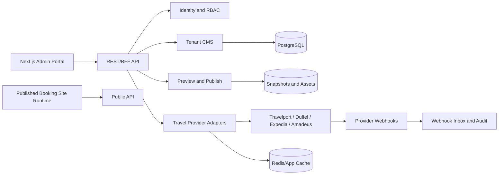

# easyGDS Technical Decision Inputs

## Purpose

This document records the technical choices that need to be made for the easyGDS CMS admin portal, the recommended starting point for each choice, and the questions that would change the recommendation.

## Audience

| Audience | Use |
|---|---|
| Engineering lead | Drive ADRs and architecture approval |
| Frontend lead | Choose Next.js, React, state, package, and UI patterns |
| Backend/API lead | Shape API, tenant, integration, and publish contracts |
| Design lead | Shape token, component, and brand system |
| Product owner | Understand technical trade-offs behind scope choices |

## Scope

| Included | Not included |
|---|---|
| Candidate stack choices | Final ADRs |
| Pros, cons, and risks | Detailed implementation specs |
| Next.js cache and rendering considerations | Full performance test plan |
| Integration provider implications | Commercial vendor evaluation |

## Table of Contents

1. [Current Technical Framing](#current-technical-framing)
2. [Decision Matrix](#decision-matrix)
3. [Recommended Architecture Baseline](#recommended-architecture-baseline)
4. [Frontend Architecture Inputs](#frontend-architecture-inputs)
5. [Backend and API Inputs](#backend-and-api-inputs)
6. [Design System Inputs](#design-system-inputs)
7. [Cache, CDN, and Rendering Inputs](#cache-cdn-and-rendering-inputs)
8. [Travel Integration Inputs](#travel-integration-inputs)
9. [Open Decisions](#open-decisions)
10. [Sources Checked](#sources-checked)
11. [Related Documents](#related-documents)
12. [Revision History](#revision-history)

## Current Technical Framing

| Area | Framing |
|---|---|
| Frontend ecosystem | Next.js App Router, React, TypeScript |
| Product surface | White-label booking storefront platform with CMS capabilities |
| Migration | Vue to React, with redesign and token normalization |
| CMS model | Prefer constrained section composer before full freeform builder |
| Integration model | easyGDS-owned normalized contracts, provider adapters server-side |
| Packaging | Standalone versioned internal packages are the current input |
| Cache | Explicit data/cache rules; optimize public surfaces before authenticated builder |

## Decision Matrix

| Decision | Options | Recommended | Pros | Cons/Risks |
|---|---|---|---|---|
| Frontend framework | Next.js App Router, Remix, SPA React | Next.js App Router | Required by project, strong RSC/cache ecosystem, good BFF support | Requires clear server/client boundaries |
| Rendering model | Client-heavy SPA, RSC-first, static-first | RSC-first with client islands | Less JS, server-owned data, safer secrets | Builder still needs careful client-state architecture |
| Builder model | Template-only, section composer, full freeform drag/drop | Section composer first | Quality, speed, supportability | Less visual freedom than full DnD |
| Package model | App-local, workspace packages, standalone versioned packages | Standalone versioned packages, per current input | Clear reuse boundary, explicit APIs, independent versioning | Slower early iteration, release governance overhead, compatibility burden |
| State | Redux app-wide, Zustand app-wide, scoped stores, server-first | Server-first plus scoped builder Zustand | Keeps complexity localized | Requires discipline to avoid state sprawl |
| Server state | Raw fetch, TanStack Query everywhere, RSC + targeted TanStack Query | RSC/Server Actions default, TanStack Query in builder islands | Simple for most admin pages | Mixed model needs conventions |
| API boundary | Browser to suppliers, Next.js BFF only, backend REST+BFF | Backend REST+BFF | Hides secrets, normalizes providers, supports audit | Requires backend contract work early |
| Backend shape | Microservices, modular monolith, serverless functions only | Modular monolith first | Lower operational complexity | Needs module boundaries enforced |
| Design system | Ad hoc Tailwind, shadcn copy-only, Radix + tokens + internal UI | Standalone versioned UI/design-system package with strict easyGDS tokens | Clear reuse boundary across admin and storefront surfaces | Needs ownership, versioning, compatibility, and release discipline |
| Cache/PPR | Aggressive from day one, explicit caching later, ignore until scale | Explicit caching now, PPR later where useful | Correctness first | May leave some early performance gains unused |

## Recommended Architecture Baseline



| Layer | Responsibility |
|---|---|
| Next.js admin portal | Authenticated authoring, builder, brand studio, integration settings, publish UI |
| Public booking site runtime | Tenant-branded pages and booking flows |
| BFF/API | Tenant-aware contracts, auth enforcement, mutation orchestration |
| Tenant CMS | Drafts, published snapshots, schema registry, content tree |
| Travel adapters | Supplier credentials, provider-specific requests, normalization, retry policy |
| Publish/preview | Preview sessions, immutable published versions, rollback, cache invalidation |
| Audit/webhooks | Mutation logs, provider event inbox, idempotent processing |

## Frontend Architecture Inputs

| Topic | Recommendation | Rationale |
|---|---|---|
| Routes | Single App Router admin app with one root layout and route groups | Keeps auth shell consistent |
| Server Components | Default for layouts, lists, dashboards, settings, integrations | Data stays server-owned and reduces JS |
| Client Components | Builder canvas, drag/drop, rich text, asset pickers, palette editor, animated inspectors | These need browser APIs and local interaction |
| Server Actions | Admin CRUD, brand updates, publish requests, integration config mutations | Good fit for form-like mutations |
| Route Handlers/BFF | Public endpoints, webhooks, proxy behavior, API facade | Route Handlers are public HTTP endpoints, so auth/authorization must be explicit |
| TypeScript | Strict mode, generated types from OpenAPI, branded IDs for tenant/site/page | Prevents ID mixups and contract drift |
| Route tree | `(public)/login`, `(app)/sites`, `(app)/sites/[siteId]/builder`, `brand`, `content`, `integrations`, `publish`, `settings` | Matches product IA |

### Proposed Route Tree

```text
app/
  layout.tsx
  (public)/
    login/page.tsx
  (app)/
    layout.tsx
    sites/
      page.tsx
      new/page.tsx
      [siteId]/
        layout.tsx
        page.tsx
        builder/page.tsx
        brand/page.tsx
        content/page.tsx
        integrations/page.tsx
        publish/page.tsx
    settings/page.tsx
```

## Backend and API Inputs

| Topic | Recommendation | Rationale |
|---|---|---|
| Backend shape | Modular monolith first | Tenant CMS, publish, and integrations need fast iteration |
| API style | REST + BFF | Admin workflows map well to resources and commands |
| Auth | HTTP-only secure cookies for admin sessions | Avoids JWT storage in browser |
| RBAC | Capability-based checks under role labels | UI can gate by capability, backend remains source of truth |
| Tenant model | Tenant can own many sites | More flexible for agencies and multi-brand customers |
| Publish model | Draft snapshot, preview session, async publish job, immutable published snapshot, pointer rollback | Keeps preview/publish/cache safe |
| Webhooks | Append-only inbox, idempotent processors, audit trail | Provider events can be retried and reordered |

### Candidate API Surface

| Method | Path | Purpose |
|---|---|---|
| `GET` | `/api/admin/v1/me` | Current user, tenants, permissions |
| `GET` | `/api/admin/v1/tenants/:tenantId/sites` | Site list |
| `GET` | `/api/admin/v1/sites/:siteId/editor-schema` | Builder schema |
| `GET` | `/api/admin/v1/sites/:siteId/draft` | Draft snapshot |
| `PUT` | `/api/admin/v1/sites/:siteId/draft` | Autosave draft |
| `POST` | `/api/admin/v1/sites/:siteId/preview-sessions` | Mint preview URL |
| `POST` | `/api/admin/v1/sites/:siteId/publish-jobs` | Trigger publish |
| `GET` | `/api/admin/v1/publish-jobs/:jobId` | Publish status |
| `GET` | `/api/admin/v1/tenants/:tenantId/integrations` | Integration health |
| `POST` | `/api/admin/v1/travel/search/hotels` | Normalized hotel search |
| `POST` | `/api/admin/v1/travel/search/air` | Normalized air search |
| `POST` | `/api/admin/v1/travel/bookings` | Create booking |
| `GET` | `/api/admin/v1/audit-logs` | Filtered audit feed |

## Design System Inputs

| Layer | Decision |
|---|---|
| Primitive tokens | Raw color, spacing, typography, radius, shadow, motion values |
| Semantic tokens | Brand roles: background, surface, primary, accent, success, warning, danger |
| Component tokens | Button, input, card, sidebar, canvas, dropzone, publish status |
| Brand Studio | Logo, colors, fonts, radius, density, imagery style, curated presets |
| Admin vs public themes | Admin chrome should remain easyGDS-branded; preview/public render tenant theme |
| Component boundaries | Foundations, primitives, layout, CMS builder, Brand Studio, travel-domain components |
| Accessibility | WCAG 2.1 AA, keyboard DnD alternative, visible focus, reduced motion |

## Cache, CDN, and Rendering Inputs

| Area | Recommendation |
|---|---|
| Authenticated admin pages | Mostly dynamic/server-rendered; do not rely on CDN HTML caching |
| Static assets | Cache aggressively at CDN: JS, CSS, images, fonts |
| Reference data | Cache with explicit TTL: templates, countries, provider metadata, theme presets |
| Draft CMS content | Bust or update immediately on autosave |
| Published snapshots | Immutable versions; CDN/object storage; purge or repoint on publish |
| Preview | Preview-only namespace and signed preview tokens; bypass published CDN state |
| Cache Components | Consider after route/data boundaries stabilize |
| PPR | Candidate for public pages, template galleries, dashboards; not required for builder correctness |

### Next.js Notes Checked

| Topic | Current doc signal |
|---|---|
| App Router latest docs | Current App Router docs showed latest version `16.2.2` on 2026-05-03 |
| Server and Client Components | Layouts/pages are Server Components by default; Client Components are needed for state, effects, event handlers, and browser APIs |
| Cache Components | Next.js 16 introduces `cacheComponents`; newer cache APIs use `use cache`, `cacheLife`, `cacheTag`, `revalidateTag`, `updateTag`, and `revalidatePath` |
| Previous caching model | If not using Cache Components, `fetch` cache options, `unstable_cache`, route segment `revalidate`, and `revalidatePath`/`revalidateTag` remain relevant |
| CDN caching | Static and ISR pages can be cached by CDNs that respect `s-maxage`; on-demand revalidation needs CDN purge coordination |
| PPR | PPR serves a static shell and streams dynamic portions; platform support matters if self-hosting or using custom CDN |

## Travel Integration Inputs

| Provider | Strong fit | Decision impact |
|---|---|---|
| Travelport JSON APIs | Enterprise GDS/NDC air and hotel breadth | OAuth tokens, workbench model, time-bound search/workbench sessions |
| Duffel | Modern API-first air and stays, cleaner developer experience | Offer expiry and webhooks should be first-class UI concepts |
| Expedia Rapid Lodging | Hotel-first launch | Static property content sync, signature auth, booking notifications |
| Amadeus Self-Service | Prototyping and selective APIs | Rate limits and commercial fit need validation before anchoring platform |

### Integration Rules

| Rule | Why |
|---|---|
| Browser never calls supplier APIs directly | Protects credentials and avoids provider schema coupling |
| Store normalized and raw payloads | Enables frontend simplicity plus audit/debug |
| Surface `expires_at`, `requires_reprice`, policies, and provider actions | Travel offers are time-bound and provider-specific |
| Use idempotency for booking and webhook processing | Provider events can retry or arrive out of order |
| Expose provider capabilities to admin | Avoids pretending every supplier supports every feature |

## Open Decisions

| Decision | Blocking question | Owner |
|---|---|---|
| Runtime split | Are generated public sites separate from admin? | Engineering |
| First integration | Which provider and vertical launch first? | Product/backend |
| Payment model | Is easyGDS merchant of record? | Product/legal/backend |
| Builder depth | Section composer or full drag/drop in v1? | Product/design/frontend |
| Tenant scope | One site or many sites per tenant? | Product/backend |
| Cache strategy | Deployment target and CDN behavior? | Engineering/infra |
| Package extraction | Which standalone packages are needed, who owns them, and how are versions released? | Frontend |
| Vue migration | Which components carry required logic? | Frontend/product |

## Sources Checked

| Source | Link |
|---|---|
| Next.js App Router docs | https://nextjs.org/docs/app |
| Next.js Server and Client Components | https://nextjs.org/docs/app/getting-started/server-and-client-components |
| Next.js `cacheLife` | https://nextjs.org/docs/app/api-reference/functions/cacheLife |
| Next.js Revalidating | https://nextjs.org/docs/app/getting-started/revalidating |
| Next.js CDN Caching | https://nextjs.org/docs/app/guides/cdn-caching |
| Next.js PPR Platform Guide | https://nextjs.org/docs/app/guides/ppr-platform-guide |
| Next.js Backend for Frontend | https://nextjs.org/docs/app/guides/backend-for-frontend |
| Travelport OAuth | https://support.travelport.com/webhelp/JSONAPIs/Airv11/Content/GeneralProject/Oauth.htm |
| Travelport search/workbench FAQ | https://support.travelport.com/webhelp/JSONAPIs/Airv11/Content/Air11/General/AirFAQs.htm |
| Duffel webhooks | https://duffel.com/docs/api/webhooks/ping-webhook |
| Duffel offer expiry help | https://help.duffel.com/hc/en-gb/articles/360021052820-What-happens-when-an-offer-expires |
| Expedia Rapid Lodging overview | https://developers.expediagroup.com/docs/products/rapid/lodging/how-it-all-works |
| Expedia Rapid signature auth | https://developers.expediagroup.com/rapid/lodging/reference/signature-authentication |
| Expedia Rapid notifications | https://developers.expediagroup.com/docs/products/rapid/lodging/notifications |
| Amadeus rate limits | https://developers.amadeus.com/self-service/apis-docs/guides/developer-guides/api-rate-limits/ |

## Related Documents

| Document | Relationship |
|---|---|
| [00-index.md](./00-index.md) | Doc map |
| [01-brainstorm-questions.md](./01-brainstorm-questions.md) | Inputs needed before final decisions |
| [02-kickoff-prep.md](./02-kickoff-prep.md) | Meeting format for collecting answers |
| [04-build-approach.md](./04-build-approach.md) | Uses these decisions to phase delivery |

## Revision History

| Date | Author | Change |
|---|---|---|
| 2026-05-03 | Codex | Created technical decision inputs |
